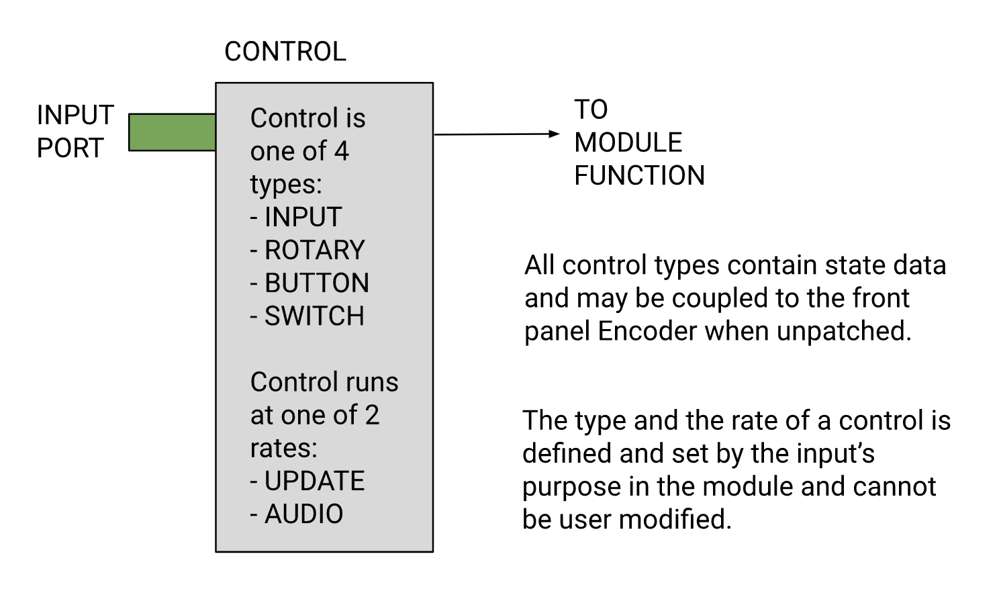

# Dectet - User Manual

This manual is a release-specific document. Search for the [release](https://github.com/acumartini/dectet-public/releases) version that matches what you have running on your device, which includes a link to the User Manual for that firmware version.

## Disclaimer

The content of this manual is intended for informational use only, is subject to change without notice, and should not be construed as a commitment by Arrangement Audio LLC. Arrangement Audio LLC assumes no responsibility or liability for any errors or inaccuracies that may appear in this document.

---

# Table of Contents

- [WELCOME](#welcome)
  - [Specification](#specification)
  - [Documentation Overview](#documentation-overview)
- [INSTALLATION](#installation)
  - [Power Requirements](#power-requirements)
  - [Desktop Operation](#desktop-operation)
  - [Eurorack Module](#eurorack-module)
  - [Eurorack I/O Expander](#eurorack-io-expander)
- [USER INTERFACE](#user-interface)
  - [Front Panel](#front-panel)
  - [Rack](#rack)
  - [Module](#module)
  - [Control](#control)
    - [Input](#input)
    - [Rotary](#rotary)
    - [Button](#button)
    - [Switch](#switch)
  - [Output](#output)
  - [Display](#display)
    - [Module View](#module-view)
    - [Patchbay Interface](#patchbay-interface)
    - [Navigation Bar](#navigation-bar)
      - [CPU Indicator](#cpu-indicator)
      - [Settings](#settings)
        - [Rack Settings](#rack-settings)
        - [Load](#load)
        - [Save](#save)
        - [UX Settings](#ux-settings)
      - [MIDI Learn](#midi-learn)
      - [Controller Interface](#controller-interface)
      - [Control Pagination](#control-pagination)
  - [Encoder](#encoder)
  - [Buttons](#buttons)
  - [Inputs and Outputs](#inputs-and-outputs)
  - [USB Device](#usb-device)
  - [USB Host](#usb-host)
  - [LED](#led)
- [MODULES](#modules)
  - [AT - Attenuate](#at---attenuate)
  - [CQ - Cartesian Sequencer](#cq---cartesian-sequencer)
  - [CK - Clock](#ck---clock)
  - [DL - Delay](#dl---delay)
  - [DV - Euclidean Clock Divider](#dv---euclidean-clock-divider)
  - [EV - Envelope Generator and VCA](#ev---envelope-generator-and-vca)
  - [EQ - Parametric Band-pass Equalizer](#eq---parametric-band-pass-equalizer)
  - [FL - Envelope Follower](#fl---envelope-follower)
  - [FN - Function Generator](#fn---function-generator)
  - [FT - Ladder Filter](#ft---ladder-filter)
  - [GP - Granular Processor](#gp---granular-processor)
  - [IO - Input/Output](#io---inputoutput)
  - [LO - Low-Frequency Oscillator](#lo---low-frequency-oscillator)
  - [MC - Macro Controller](#mc---macro-controller)
  - [MD - MIDI Controller](#md---midi-controller)
  - [MM - Matrix Mixer](#mm---matrix-mixer)
  - [MS - Mid-side Processor](#ms---mid-side-processor)
  - [MX - Mixer](#mx---mixer)
    - [Full Mixer Mode](#full-mixer-mode)
  - [NN - Deep Neural Network](#nn---deep-neural-network)
  - [NZ - Noise Generator (+ Sample and Hold + Random Looper + Slew Rate Limiter)](#nz---noise-generator--sample-and-hold--random-looper--slew-rate-limiter)
  - [OS - Oscillator](#os---oscillator)
  - [PV - Plate Reverb](#pv---plate-reverb)
  - [QT - Binary Quantizer](#qt---binary-quantizer)
  - [RC - CV Recorder](#rc---cv-recorder)
  - [RV - Room Reverb](#rv---room-reverb)
  - [SA - Spectral Analysis](#sa---spectral-analysis)
  - [SQ - Binary Step Sequencer](#sq---binary-step-sequencer)
  - [UA - USB Audio Interface](#ua---usb-audio-interface)
  - [VA - Voltage-Controlled Amplifier](#va---voltage-controlled-amplifier)
  - [XY - Custom Wavetable OSC (3D Touch Looper)](#xy---custom-wavetable-osc-3d-touch-looper)
- [RACKS](#racks)
  - [Audio Interface](#audio-interface)
  - [Cartesian Sequencer](#cartesian-sequencer)
    - [Cartesian Sequencer - Controller Interface](#cartesian-sequencer---controller-interface)
  - [Control Voltage Recorder](#control-voltage-recorder)
    - [Control Voltage Recorder - Controller Interface](#control-voltage-recorder---controller-interface)
  - [Deep Neural Network](#deep-neural-network)
  - [Drone](#drone)
  - [Dual Cartesian Sequencer](#dual-cartesian-sequencer)
    - [Dual Cartesian Sequencer - Controller Interface](#dual-cartesian-sequencer---controller-interface)
  - [Dual Step Sequencer](#dual-step-sequencer)
    - [Dual Step Sequencer - Controller Interface](#dual-step-sequencer---controller-interface)
  - [Filtered Delay](#filtered-delay)
  - [Filtered FDN](#filtered-fdn)
  - [Filtered Plate Reverb](#filtered-plate-reverb)
  - [Filtered Room Reverb](#filtered-room-reverb)
  - [Granular Processor](#granular-processor)
  - [MIDI Synthesizer](#midi-synthesizer)
  - [Mixer Macro Control](#mixer-macro-control)
  - [Parametric Follower](#parametric-follower)
  - [Spectral Resynthesizer](#spectral-resynthesizer)
  - [Step Sequencer](#step-sequencer)
    - [Step Sequencer - Controller Interface](#step-sequencer---controller-interface)
  - [XYZ Drone](#xyz-drone)
    - [XYZ Drone - Controller Interface](#xyz-drone---controller-interface)
  - [XYZ MIDI Synthesizer](#xyz-midi-synthesizer)
    - [XYZ MIDI Synthesize - Controller Interface](#xyz-midi-synthesize---controller-interface)
- [FIRMWARE UPDATES](#firmware-updates)
- [CALIBRATION](#calibration)
- [TROUBLESHOOTING](#troubleshooting)
- [APPENDIX](#appendix)
  - [A - Patchbay Operation](#a---patchbay-operation)
    - [Navigate and Patch](#navigate-and-patch)
    - [Patch Filter/Follow](#patch-filterfollow)

# WELCOME

Welcome to the Arrangement Audio Dectet! The Dectet is a digital synth/utility macro module feautring an intuitive user interface and a touchscreen display, giving you access to a variety of virtual modular environments. Modules within the environments expose all of their controls as patchpoints enabling a high level of customization, and stored presets enable repeatability. The display doubles as a playable instrument for both internal synthesis and external control.  While shipped as a slim desktop unit, the Dectet also operates as a 15Hp Euorack module.

## Specification

- All inputs: op-amp buffered with >1M impedance
- Audio codec: 24-bit 48kHz
- Processing rate: audio rate for all inputs and outputs
- Latency: depends on the virtual modular environment and signal path, but is a minimum of ~610 microseconds
- Connectivity: GND referenced (internally balanced) and DC coupled connections for all inputs and outputs
- CV input range: +/- 5V for all inputs
- Internal processing: 32-bit floating point
- 2.8” IPS display with capacitive touch: ~40fps (depending on CPU load) with 100Hz touch input sample rate

## Documentation Overview

This manual covers installation requirements for desktop operation and the Eurorack module, as well as a detailed review of the User Interface, including navigation, encoder and button controls, MIDI/USB connectivity, presets, and global settings. It also walks through all the available Modules and Racks, which make up the virtual modular environments. Finally, firmware updates and calibration are covered.

# INSTALLATION

## Power Requirements

- Desktop mode: 330mA of +12V DC power
- Eurorack module - 270mA on the +12v rail and 57mA on the -12V rail

## Desktop Operation

The Dectet ships as a desktop unit powered by the provided DC wall adapter power supply (TODO: V and A rating).

TODO: pic

| Notes |
| - |
| The power supply jumpers must be on the rightmost pins (when looking at the PCB) to enable DC power mode |

## Eurorack Module

The Dectet is designed to fit into a Eurorack case as a 15Hp module and the shrouded 10-pin connector on the PCB accepts a cable from a standard Eurorack power bus.

| Notes |
| - |
| To pull power from both the +12V and -12V rails, the power supply jumper must be on the leftmost pins (when looking at the PCB). However, the device can be powered by only the +12V rail if the jumper is on the rightmost pins |


TODO: add pic with labeled +12v pins

## Eurorack I/O Expander

The expander connects directly to the main panel PCB via a 6-pin connector (power) and an 8-pin connector (signal/control). This HW is under development with more details coming soon!

# USER INTERFACE

The user interface is built around sets of virtual modules (racks), their controls, and internally/externally patching controls and module outputs. To help clarify the discussion around UI design and functionality we define a set of overloaded terms scoped to the Dectet worldview in the following subsections.

## Front Panel

The Dectet front panel consists of two parts, the main panel and the I/O expander. The main panel contains all of the primary User Interface components and I/0, while the expander (coming soon!) contains only additional I/O.


## Rack

A Rack is a set of Modules with a normalized patch designed to accomplish a specific sound design or control/workflow utility goal. Racks will usually contain a set of core modules that are patched together and a few auxiliary modules that are generally useful or could be used to make more complex patches. The number of modules available in a Rack is limited by resource constraints.


| Notes |
| - |
| A Rack can be renormalized or completely unpatched via the [Rack Settings](#rack-settings) interface |

## Module

A Module is a virtual processing unit with a fixed number of Controls and Outputs. A Module’s Control interface is visible when the Module’s tab is pressed on the bar at the top of the [Module View](#module-view).


| Notes |
| - |
| In general, Module Controls are sampled, and Outputs are updated, at 48kHz. However, all Modules are responsible for maintaining their own sense of time and sample/update rates are based on Modules design requirements and resource limitations |

## Control

A Control is a parameter that is also a patch point. Depending on its type, a Control’s value can be set via the touchscreen or encoder.  The Encoder is coupled to a Control by pressing the Control name, which sets the Control to active (indicated by an orange bar above the Control). Controls can also be MIDI mapped via a [MIDI learn](#midi-learn) operation (indicated by a magenta bar above the Control), at which point they can be driven by incoming MIDI Continuous Controller (CC) messages regardless of the current display view. The button at the bottom of a Control is used to enter the Patchbay with that Control as the target for an Output. All controls have labels, specific to their functionality, to indicate their current value. The following subsections cover the 4 types of Controls in detail.



### Input

An Input has no UI elements/interaction other than patch-ability. However, an Input control can be made active so that its value can be set. The position and color of the bar within an Input Control reflects its current value where a green bar at the top of the control represents a maximum value (+5V), a purple bar at the center position represents a 0 value, and a red bar at the bottom of the control represents a minimum value (-5V). The bar ranges from white to black for all other values depending on the current sensitivity setting for the control where black indicates the finest control and white indicates the coarsest control. When the Input Control is active, the encoder can be used to set both the value (turning the encoder) and the sensitivity (pressing and turning the encoder). This functionality is useful for setting a constant Voltage for an Input.


### Rotary

A symmetric rotary knob-like interface with finite limits where the value is 0 when set to noon. The behavior of the knob, when turned counter/clockwise from the 0-point, is Module specific. When the Rotary Control is active, the encoder can be used to set both the value (turning the encoder) and the sensitivity (pressing and turning the encoder). Control sensitivity is indicated by knob color where black indicates the finest control and white indicates the coarsest control. Special knob colors are used to indicate a 0 value (purple) and at the positive/negative limits (green/red). After patching a Rotary Control the touchscreen and encoder can no longer be used to set the Control’s value, but the display will provide feedback on the value by updating the position of the Control knob.


### Button

A momentary switch that can be pressed and released via the touchscreen UI. When patched, a button is considered pressed when the modulation source is greater than 0.5 (2.5V). Control Buttons can be pressed via the encoder (clockwise or counterclockwise rotation) when the Control is active. A Button’s color is yellow when pressed.


### Switch

A standard latching switch to capture ON/OFF state. When patched, a switch is toggled ON by a modulation source greater than 0.5 (2.5V) and OFF by a source less than 0.5 (2.5V). Control Switches can be toggled via the encoder (counter/clockwise = OFF/ON) when the Control is active. A Switch’s color is purple when ON.


| Notes |
| - |
| A Control can be set as active by pressing the Control label on the display |
| Controls values can be set by dragging the knob (when rotary Control touch-ability is enabled via the [UX Settings](#ux-settings)) or by pressing the button on the display. The encoder can be used to set values when a Control is active. The only way to adjust an Input Control value is by using the encoder |
| A Control can be patched to any Module Output via the Patchbay button |
| All Controls have the ability to enter a disabled state based on a Module’s settings. A disabled Control will appear grayed out and all normal UI interaction is suspended |
| All Controls are capable of through-0 modulation |

## Output

An Output is a virtual signal produced by a Module. Modules can have up to 50 outputs, which are available as patch points in the Patchbay. We talk more about the Patchbay [here](#patchbay-interface), but one important aspect of virtual signals is that they can be patched to any number of downstream Controls.

| Notes |
| - |
| A Module’s Outputs are only visible in the Patchbay interface |

## Display

The primary element of the Dectet user interface is the capacitive touchscreen display. The Display is used to navigate/set/patch Module Controls, switch between Racks, load/save presets, manage UX options, and assign MIDI CC mappings. Some Racks have a custom controller interface that enables performance. The Display also provides real-time feedback for Control modulation. The following subsections cover the primary UI elements/views in detail.

### Module View

The Module View is the main interface for access to Module Controls for all Modules in a Rack. The bar at the top of the view contains abbreviated names for each Module and pressing on a Module name switches the view that Module’s Controls. 10 Module Controls are visible at a time and the Control interface is paginated. The two rectangular buttons on the Navigation Bar can be used to switch Control pages, and indicate the end of available pages when grayed out. For faster navigation, the two buttons next to the encoder are dedicated to Control page navigation. At the bottom of each Module Control is a button that allows you to enter the Patchbay with that Control as the patch target. The Patchbay can be seen as a subset of the Module View, which we discuss in detail in the following subsection.


### Patchbay Interface

The Patchbay interface includes two views, “Navigate and Patch” and “Patch Filter/Follow”, that enable quick patching and system patch filtering/overview respectively. The Back Button is used to navigate back to the Module View.

Detailed operation of the patchbay is covered in [Appendix A](#a---patchbay-operation).


### Navigation Bar

The Navigation bar is available while in the Module View and provides access to the CPU Indicator, general Settings, MIDI Learn functionality, the Controller Interface (when available), and Control Page navigation. We will cover these elements of the UI in detail in the following subsections.


#### CPU Indicator

The CPU Indicator provides feedback on the current CPU load where a bright red square shows at near 100% utilization and bright green shows at less than 50% utilization. There is no user interaction with the indicator other than visual feedback, however, the UI will respond/update slower when nearing 100% CPU usage.

#### Settings

The Settings button (Gear icon) opens the global Settings interface, where a user can swap Racks, Load and Save patch presets, and adjust UX parameters. The global settings interface is divided into individual settings pages, which a user can switch between by pressing the tabs at the bottom of the display. We discuss each settings page in the subsections below. Pressing the back arrow allows navigation back to the Module View. The Left HW Button can be used to navigate back to the Module View from the Settings interface as an alternate workflow.


##### Rack Settings

The Rack setting page is used to swap between active Racks. There are four types of Racks available to choose from; SYNTH, SEQ, FX, and UTIL. The tabs in the middle of the Rack settings interface are used to switch between Rack types. SYNTH racks generally produce sounds, SEQ racks focus on sequencing via controller interfaces and loops but also generate sound in some cases, FX racks are primarily used for signal processing and sound design, and UTIL racks focus on combinations of modules for macro control and modulation. There is some overlap in functionality between racks in each group, but the goal here is to help organize the Racks into groups for more intuitive navigation. When swapping to a new Rack it will be loaded with a normalized patch. The three buttons at the top of the Rack settings page can be used to remove all patch connections (`Clear Patch`), re-normalize the Rack back to its starting state (`Normalize`), and load the last quicksave preset (`Quicksave`).

| Notes |
| - |
| `Normalize`-ing a Rack removes all patches and re-patches the Rack according to its startup configuration, however, Control values are not reset unless explicitly included in the normalization (i.e., Racks with MX channel linking and pan settings) |
| The system will check for Control changes every ~20s and perform a Quickave operation (saves to `preset-1.bin`). A quicksave does not capture changes to Modules that store large blocks of data (i.e., sample buffers) or state variables that are not represented by controls (i.e., MC `Reset` state) |


##### Load

To Load a preset select the `LOAD` tab at the bottom of the Settings interface and press one of the 50 presets (divided into groups of 10). A preset button is green when a preset is available and grey when there is no preset saved. Pressing a preset button that contains a preset will reboot the device and load the selected preset with its Rack, patches, and Module/Control state.


##### Save

To Save (or Delete )a preset select the `SAVE` tab at the bottom of the Settings interface and press one of the 50 presets (divided into groups of 10). A preset button is red when a preset is saved at that location and grey when there is no preset saved. Press a button with no saved preset to captures the current Rack with its patch points, the state of all Module Controls, and other important Module-specific data. Pressing a button that contains a preset will present an Overwrite Confirmation message box, and pressing `Overwrite` will overwrite the preset. To cancel the overwrite, press the `X` to close the message box. To delete a preset, press and hold a button with a saved preset. A a Delete Confirmation message box will appear and pressing the `Delete` button will delete the preset. To cancel the delete, press the `X` to close the message box.


##### UX Settings

The UX tab of the Settings interface allows you to set global parameters for the User Experience. All UX settings are persisted and recalled at device startup. In this firmware version, there are 3 options available:

1. Rotate Device - Reboot the device with the entire UI rotated 180 degrees. HW button functionality is swapped and IO continues to be numbered from left to right.
2. Enabling/Disable Rotary Touch - Toggles the ability to turn encoders by touching and dragging the encoder knob on the UI.
3. Sleep Interval - Select the amount of time for inactivity before the device enters sleep mode (to preserve display life).


#### MIDI Learn

The MIDI Learn button (MIDI icon) enters and exits MIDI learn mode, which allows you to map incoming MIDI CC information to any Module Control. A single CC number can be mapped to any number of Controls and each mapping counts towards a total limit of 100 mappings. MIDI Learn functionality is not channel-aware and an incoming CC over any channel can be used to modulate a mapped Control. However, if the MIDI Module is present in a rack the incoming MIDI signals can be filtered via the Channel Control. A new MIDI mapping is created as follows:

1. Plug a USB MIDI-capable device into the USB host jack.
2. Press the MIDI Learn button, which will now be an orange color indicating that MIDI Learn mode is active.
3. Choose the Control you want to map to by making it the active control (press on the Control name so that the bar above the Control becomes magenta).
4. Send a signal from the MIDI CC number you would like to be mapped to the Control
At this point, a MIDI mapping has been made, but the UI will show no changes. This is because the active Control state takes precedence over the MIDI mapping state, which includes both encoder control and Control coloring.
5. To change a MIDI mapping simply send a different CC number to the Control, which replaces an existing mapping.
6. To use this new mapping first disable MIDI Learn mode, then move (make a different Control active) or disable (press the Control name) the active state for the Control you just mapped. The bar above the Control will now be an orange color and the value of the Control will reflect the current value of the mapped CC.


#### Controller Interface

The Controller interface is only available for specific Racks and is mapped to a single Module within that Rack. When a Module with a Controller interface is present the Controller interface icon will be white, otherwise, it will be disabled and grayed out. Each Controller interface is unique in its functionality and is discussed in detail in the associated Module section below. Pressing the back arrow allows navigation back to the Module View and the Controller Help button can be used to access a brief description of the Controller function. In addition, the Left HW Button can be used to navigate back to the Module View from the Controller interface as an alternate workflow.

#### Control Pagination

The Control pagination indicators are small buttons that double at pagination boundary indicators. The primary way to navigate pages is using the HW buttons, but the indicator buttons can be used to scroll left/right through a Module's available Control pages. When an indicator is grayed out it means there are no more Control pages available in that direction.

| Notes |
| - |
| Display performance can be affected by CPU load. Some Modules affect display performance more than others, but the Racks are designed such that under maximum Module load the interface is still usable |
| Presets are stored on the SD card (inserted into the card reader exposed on the front panel) as text files. You can share preset files with other Dectet devices, but presets are not guaranteed to be backwards compatible |
| MIDI mapping of CC signals to Controls is not intended for programmatic modulation, i.e. CV simulation over CC. The intended use case is to enable playability through an external MIDI interface with faders and knobs. Having many CC mappings modulate simultaneously will impact Display performance |

## Encoder

The optical encoder is the primary means of granular control over Module Control parameters. It doubles as a navigation controller in both the Module view and Patchbay. To adjust a Control’s value the Control must be the active Control. This is accomplished by pressing the Control name. If there is no active Control, then turning the encoder scrolls through the Modules tabs and pressing/turning the encoder scrolls through the current Module's Control pages. When an active Control is selected turning the encoder sets the Control's value and pressing/turning the encoder sets the Control's sensitivity (clockwise increases sensitivity). Control sensitivity is indicated by knob color, with black being the least sensitive (fine) and white being the most sensitive (coarse).

| Notes | |
| - | - |
| Encoder Turn + NO Active Control | Scroll through Module tabs |
| Encoder Press + Encoder Turn + NO Active Control | Scroll through the current Module's Control pages |
| Encoder Turn + Active Control | Adjust Control value |
| Encoder Press + Encoder Turn + Active Control | Adjust Control sensitivity |

## Buttons

The two HW buttons on the Dectet are dedicated to navigation. While in the [Module view](#module-view), the buttons are used to scroll through the current Module's Control pages. While in the [Patchbay Interface](#patchbay-interface), the buttons are used to scroll the current Module's Output/Control pages and also through the filtered patch list. When not in the Module View or Patchbay view, the left button will trigger the UI's back button (if present) to return to the previous view.

| Notes | |
| - | - |
| Module/Patchbay View + Button Left/Right | Scroll through Module Control pages |
| Patchbay View + Button Left/Right | Scroll through Module Output/Control pages and the filtered patch list |
| Other View | Button Left triggers the UI's back button when present |

## Inputs and Outputs

All HW Inputs and Outputs are ground-referenced (internally balanced) and DC coupled. Signals are processed at a 24-bit 48kHz resolution. The Dectet comes calibrated with each channel’s DC offset and voltage gain (IN/OUT) stored internally. However, if the analog components drift out of calibration please consult the [Calibration](#calibration) routine. All channels are designed for a +-5V signal range but are buffered to safely handle larger voltages (with added distortion).

| Notes |
| - |
| Inputs are designed for +-5V signals, but are buffered to safely handle signals up to +-10V. However, signals larger than +-5V will be distorted prior to processing |

## USB Device

The USB-C device port is used to interface with a computer to enable [firmware updates](#firmware-updates), [audio interface](#audio-interface) capabilities, and data transfer to and from the SD card (TODO: link for MTP information).

## USB Host

The USB-C host connector is a standard USB host that can provide 5V power to peripherals up to 250 mA, which is drawn from the +12V power bus (in addition to the 240mA baseline). The primary purpose of this port is to provide a USB MIDI host for an external MIDI controller. When an external MIDI controller is connected, CC signals are available for [MIDI Learn](#midi-learn) functionality/modulation. When the [MIDI Module](#md---midi-controller) is in scope, pitch, velocity, gate, and channel/poly aftertouch signals are available as Module outputs.

## LED

The multicolor LEDs under the HW switches provide feedback on the current state of the device.

| Notes | |
| - | - |
| Red | System startup |
| Blue | Normal operation |
| Purple | Auxillary operation (Loading/Saving presets and [Calibration](#calibration) mode) |

# MODULES

Modules are the building blocks of a virtual rack environment. They define a set of Controls and Outputs, and process incoming signals to perform a specific task. Modules are encapsulated and share no data with other Modules except through their Controls and Outputs. The following subsections describe each Module in detail along with a breakdown of their Controls/Outputs, processing idiosyncrasies, Control interdependencies, and latency expectations. Control names are abbreviated in the Notes to reflect what is shown on the display. When discussing latency expectations for Controls we use two terms to specify the sample rate:

- Update => sampled at ~1ms intervals
- Audio => exactly 48kHz sample rate

Audio rate Controls can generally be considered suitable for Audio rate modulation, although modulation of that speed may not always be applicable. The update rate is used for Controls that do not need to be sampled at Audio rates to limit CPU-intensive processing when possible.

The Control/Output Notes tables below abbreviate the control type and sample rate columns to help consolidate the information. The control type column (T) has the abbreviations Rotary (R), Button (B), Switch (S), and Input (I). The sample rate column (R) has the abbreviations Update (U) and Audio (A).

The order of Controls/Outputs in UI is preference/performance focused. The order of the Controls/Outputs in the tables below is documentation focused and does not necessarily reflect their order in the UI.

## AT - Attenuate

The Attenuate module is a 10-channel attenuverter with offset. As an attenuverter, this module can control the amplitude of a signal and reverse its polarity. By applying an offset, you can place the signal precisely where you want it. With no input patched, the offset Control applies a constant DC signal to the associated Output (1-10). There is a very small amount of slew rate limiting applied to attenuation deltas to soften the pops associated with abrupt signal magnitude changes.

| Control Notes | T | R | |
| - | - | - | - |
| In 1-10 | I | A | The incoming signal for attenuation |
| Attn 1-10 | R | A | Attenuverter constant |
| Offst 1-10 | R | A | A DC offset to be applied to the attenuated signal |

| Output Notes | |
| - | - |
| A/0 1-10 | Attenuverter signal with offset |

## CQ - Cartesian Sequencer

A Cartesian sequencer allows a user to create non-linear sequences within a 3-dimensional plane. This module allows for three directions of movement (XYZ, where 1<=X<=5, 1<=Y<=2, and 1<=Z<=5) for a total of 50 individually assignable steps. Non-linear sequences are generated by sending triggers to the `Up`, `Down`, `Left`, `Right`, `Forward`, and `Back` direction Controls. There are also several auxiliary step management Controls to add interest and enable repeatable patterns. Steps can also be made probabilistic by increasing the `Prob` Control, and drones are made possible by switching ON the `Hold` Controls. Steps also have a magnitude associated with them but there are only 10 `Mag` Controls, which are shared between the 5 Z planes with 10 steps each. Finally, there is a quantizer built into this module to facilitate rapid melodic sequence generation. The quantizer is binary and uses a root note and 12-bit number to determine the scale, where all scales are possible within the 12-bit binary range. Quantized signals are based on V/Octave standards (C4=0V). Gating the `Rnd N` Control will quantize all 10 notes for the current Z plane to the selected root note and scale.

| Control Notes | T | R | |
| - | - | - | - |
| Down | B | U | Step down in the Y direction (Y + 1) |
| Up | B | U | Step up in the Y direction (Y - 1) |
| Right | B | U | Step right in the X direction (X + 1) |
| Left | B | U | Step left in the X direction (X - 1) |
| Forwrd | B | U | Step forward in the Z direction (Z + 1) |
| Back | B | U | Step back in the Z direction (Z - 1) |
| Hold | B | U | While pressed, hold the current step ignoring all step triggers |
| Pause | B | U | While pressed, pauses sequencing by ignoring all step triggers. No steps signals are sent with the exception of Step Hold signals |
| Set | B | U | Set the current step to the starting step |
| Reset | B | U | Return the sequence to the starting step |
| Pulse W | R | U | Sets the length of Gate signals Outputs |
| Z 1-5 | B | A | Sets the Z plane directly as an alternative to using the `Forward` and `Back` Controls for melodic change |
| BinScal | R | A | A number between 2048 and 4095 that is used to determine the 12 note scale for quantization. Notes are quantized based on V/Octave (C4=0V) |
| Root | R | A | Sets the root note for randomized quantization |
| Spread | R | U | Controls how far away from the root, in notes, that random notes are selected for quantization |
| MagDif | R | U | Controls the amount of magnitude variation during randomization. A maximum value implies a random magnitude from 0 - 100% |
| Rnd N | B | U | Triggers random quantization of the 10 signals for Z plane of the current step based on the Bin Scale, Rnd Root, and Spread Controls |
| Rnd M | B | U | Triggers randomization of the 10 Mag Controls within a range determined by MagDiff |
| Depth | R | U | Set the number of planes, in the Z direction, that are triggered simultaneously to create a polyphonic cartesian sequence. For example, if the current step is at (0, 0, 0) and Depth=2, then the steps (0, 0, 0), (0, 0, 1), and (0, 0, 2) will be triggered. Depth limit is 5 and will wrap around |
| NumPly | R | U | The number of notes available for polyphonic sequencing such that only Outputs 1-N will be used for signal, magnitude, and gate. Steps with an XY coordinate greater than Num Poly will wrap around to an available polyphonic output |
| Hold 1-10 | S | A | Step hold switches shared between the 5 Z planes. When ON, the associated XY note is held for the current Z plane |
| Prob 1-10 | R | A | Step probability shared between the 5 Z planes. Increasing the value increases the likelihood that a step will trigger |
| Mag 1-10 | R | A | Step magnitudes shared between the 5 Z planes |
| SigZ1-5 1-10 | R | A | Signal assignments for each of the Z1-5 planes of 10 steps |

| Output Notes | |
| - | - |
| V/Oct  1-10 | Step signal based on XY position |
| Mag 1-10 | Step magnitude based on XY position |
| Gate 1-10 | Step gate based on XY position |
| GlbV/O | Last triggered step signal |
| GlbMag | Last triggered step signal magnitude |
| GlbG | Last triggered step signal gate |
| StartG | Sequence start gate triggered when starting step is reached |

## CK - Clock

The Clock module is a tappable bpm-based clock generator. The Tap Control can be triggered manually on the display or can be patched to synchronize with an external clock.

| Control Notes | T | R | |
| - | - | - | - |
| Play | S | A | A switch to start and stop the clock |
| Tap | B | A | Interprets triggers or an incoming signal to set the BPM Control. A minimum of 2 triggers/gates are required to determine the BPM. The BPM Control reflects changes in tempo when Tap is triggered. When patched, the resulting clock signal is ~650 microseconds behind the originating pulse |
| BPM | R | U | Sets the BPM of the clock |

| Output Notes | |
| - | - |
| Gate | Clock gate with a pulse width of 1.5ms |

## DL - Delay

The Delay module is a tape-style delay with two delay lines and five read heads on each line. The delay lines can be used for stereo delay when run in parallel, or as a longer monophonic delay when patched in series. Each read head has its Output, which enables stereo imaging from a monophonic delay. Each delay buffer holds ~1s of 24-bit 48kHz audio and buffer iterators use floating point Hermite interpolation for rich sample playback at various speeds. Reducing the speed increases delay times significantly and imparts texture. Careful attention to the total feedback amount across all read heads in a delay line is required to avoid signal saturation.

| Control Notes | T | R | |
| - | - | - | - |
| In 1-2 | I | A | Delay line inputs |
| FBIn 1-2 | I | A | Global feedback for mixing summed or external signals back into the delay lines, which is useful for cross-feedback patching |
| GlbFB 1-2 A | R | A | The amount of global feedback added to the delay lines |
| Speed 1-2 | R | A | The record and playback speed, where a maximum value indicates a sample rate of 48kHz. Decreasing the Speed will slow the sample rate, which degradates sample quality while increasing the length of the sample buffers |
| Dry | R | A | The amount of dry signal in the Outputs |
| Wet | R | A | The amount of wet signal in the Outputs |
| Pos 1/2-1-5 | R | A | Sets the read position of each read head relative to a fixed write position, which is at position 0. The closer the read head gets to 0 the shorter the delay. The difference between the read and write heads is a floating point distance in samples where the number of samples divided by the speed equals the length of the delay in seconds |
| FB 1/2-1-5 | R | A | The amount of read head signal fed back into the write head. The total feedback amount must be < 100% total to avoid signal saturation |
| Mute 1/2-1-5 | S | U | Mutes the read heads on the delay lines |

| Output Notes | |
| - | - |
| DL-R1-5 | Read head signals for delay line 1 |
| DL2R1-5 | Read head signals for delay line 2 |
| DL1 | Summed output delay line 1 |
| DL2 | Summed output delay line 2 |

## DV - Euclidean Clock Divider

The Euclidean Clock Divider module is a 5-channel clock multiplier and Euclidean rhythm generator. Floating point multipliers allow for slight frequency variance.  The rhythms can be probabilistic and chained to create complex evolving gate patterns.

| Control Notes | T | R | |
| - | - | - | - |
| Clock 1-5 | I | A | Incoming clock signal |
| Mult 1-5 | R | U | Clock multiplier (1/ 100.0 to 100.0) |
| EStep 1-5 | R | U | Number of steps in the Euclidean sequence |
| EDiv 1-5 | R | U | Division constant for the Euclidean sequence. Higher constant means more frequent steps |
| Rot 1-5 | R | U | Rotates the start point of the Euclidean rhythm |
| Prob 1-5 | R | U | Step probability. Increasing the value increases the likelihood that a step will trigger |
| ChainL | R | U | Number of Euclidean rhythms that are chained together. Chain always starts with channel 1 and progresses sequentially |

| Output Notes | |
| - | - |
| DivM 1-5 | Raw multiplied clock |
| EucR 1-5 | Euclidean rhythm |
| EndR 1-5 | End of Euclidean rhythm |
| EucC | Euclidean chain rhythm |
| EndCR | End of one section of the Euclidean chain rhythm |
| EndC | End of the entire Euclidean chain rhythm |

## EV - Envelope Generator and VCA

A 10-channel ADSR Envelope Generator with audio inputs and a built-in VCA. When an envelope is retriggered it rises from the current envelope position to preserve continuity. Holding an envelope’s gate open will allow it to proceed to and maintain the sustain phase. The release phase is triggered as soon as an envelope’s gate is closed.

| Control Notes | T | R | |
| - | - | - | - |
| In 1-10 | I | A | Incoming signals for envelope modulation |
| Trig 1-10 | I | A | Incoming gates to trigger/retrigger and sustain the envelope |
| A 1-10 | R | U | Attack |
| D 1-10 | R | U | Decay |
| S 1-10 | R | U | Sustain |
| R 1-10 | R | U | Release |

| Output Notes | |
| - | - |
| EnvS 1-10 | Envelope signal |
| EndR 1-10 | End of release gate signal |
| Sig 1-10 | Incoming signal modulated by the envelope |

## EQ - Parametric Band-pass Equalizer

A parametric stereo Band-pass Equalizer with 8-bands and idvidual controls for each channel. Left and Right channel controls can be `Link`ed to allow the left channel controls used for both channels' settings. Adjusting the `Band` controls with the starting configuration of the `FC` and `Q` controls emulates a traditional Band-pass equalizer.

| Control Notes | T | R | |
| - | - | - | - |
| In L/R | I | A | Incoming stereo signal |
| Band L/R1-8 | R | U | Band level |
| FC L/R1-8 | R | U | Center frequency for the band |
| Q L/R1-8 | R | U | Controls the width of the band around its center frequency (`FC`). Computed as `Q = Fc / BW` |
| Link | S | U | Link the channels such that the left channel controls are used for both channels' setting |
| Mono | S | U | Disables the right channel. This is used in Racks that have an mono input signal path to save CPU time |
| Reset | B | U | Reset all `FC` and `Q` controls to their starting position |

| Output Notes | |
| - | - |
| Bnd L/R1-8| Individual band signals |
| EQ L | Stereo signal left |
| EQ R | Stereo signal right |

## FL - Envelope Follower

A 2-channel envelope follower to enable loose synchronization via threshold-controlled peak detection envelopes with gate outputs. This module also has a “full” mode with 10 channels, which is used for the [Parametric Follower](#parametric-follower) Rack.

| Control Notes | T | R | |
| - | - | - | - |
| In 1-2 | I | A | Incoming stereo signal |
| Atk 1-2 | R | U | Controls the attack time for the envelope detector |
| Rel 1-2 | R | U | Controls the release time for the envelope detector |
| Thrsh 1-2 | R | U | Level at which the envelope detector will start/stop tracking a signal |

| Output Notes | |
| - | - |
| Env 1-2 | Filtered stereo signal |
| Gate 1-2 | Gate signal representing the time the envolope detector is above the threshold |

## FN - Function Generator

A 5-channel Function Generator with shapeable exponential rise and fall. Cycling the function at an audio rate can turn the functions into oscillators, but there are limitations to tuning granularity. If the `In` Control is patched the module becomes a VCA with the function serving as the amplitude of the envelope.

| Control Notes | T | R | |
| - | - | - | - |
| In 1-5 | I | A | Incoming stereo signal. If patched, the signal is multiplied by the function value to generate the channel Output |
| Trig 1-5 | B | A | Triggers the function to start 1 rise and fall cycle. If cycling, restarts the function from the start |
| Cycle 1-5 | S | A | Switches function cyclings such that the function triggers again at the end of fall |
| Hold 1-5 | S | A | Holds the function at its current value |
| Rise 1-5 | R | A | Rise time with a maximum of ~8 minutes |
| Fall 1-5 | R | A | Fall time with a maximum of ~8 minutes |
| RCrv 1-5 | R | U | The shape of the rise function where 1V is linear, < 1V is logarithmic, and > 1V is exponential |
| FCrv 1-5 | R | U | The shape of the fall function where 1V is linear, < 1V is logarithmic, and > 1V is exponential |

| Output Notes | |
| - | - |
| RiseS 1-5 | Rise start gate |
| FallS 1-5 | Fall start gate |
| Func 1-5 | Function. Multiplied by the In Control signal when patched |

## FT - Ladder Filter

A stereo resonant 4 pole low pass Ladder Filter.

| Control Notes | T | R | |
| - | - | - | - |
| In 1-2 | I | A | Incoming stereo signal |
| CTO 1-2 | R | U | Cutoff frequency with a maximum value of 20000 Hz |
| CTO Slu | R | U | Amount of slew rate limiting applied to cutoff frequency changes |
| Res 1-2 | R | U | Resonance |
| Oct 1-2 | R | U | Adjusts the cutoff frequency by Octave intervals |
| Mod | R | U | Acts as a global cutoff control by adjusting the amount of the Octave Controls are applied to the slewed filter Cutoff Frequency |

| Output Notes | |
| - | - |
| Sig L-R | Fitered stereo signal  |

## GP - Granular Processor

A Granular Processor that uses up to 35 grains to generate a stereo spread from a mono signal. The buffer holds ~1.6s of 24-bit 48kHz audio with variable speed smapling to extend the length of the buffer by down sampling. Grain iterators use floating point Hermite interpolation for rich sample playback at various speeds.

| Control Notes | T | R | |
| - | - | - | - |
| In | I | A | Incoming signal |
| D/W | R | A | The amount of incoming signal to mix into the stereo output with 0% of dry signal at position 0 |
| Freeze | S | U | Switch to stop writing to the circular buffer |
| Trigger | B | A | Trigger a grain. The total number of grains is limited to 40 and triggered grains are added to the Density setting when computing grain count |
| Start | R | U | The starting point from which grains are spawned |
| Size | R | U | Grain size where the maximum size is the entire buffer and the minimum is ~20ms |
| Spray | R | U | The region, relative to the starting point, in which grain can spawn |
| Density | R | U | Number of grains to be spawned, limited to 48 grains. O grains (Off) effectively stops granular processing |
| Space | R | U | The amount of grain overlap, where increasing the Space decreases the overlap and a maximum value implies 0 overlap |
| Spread | R | A | The position of spawned grains in the stereo field, where increasing the Spread created a broader stereo image |
| V/Oct | I | U | Determines the speed of gain playback. After a grain is created it maintains its Speed setting for the duration of its playback |
| Speed | R | A | The record speed, where a maximum value indicates a sample rate of 48kHz. Decreasing the Speed will slow the sample rate, which degradates sample quality while increasing the length of the sample buffer |
| MagDif | R | A | The amount of grain magnitude variation. A maximum value implies a random magnitude from 0 - 100% of the original signal. After a grain is created it maintains its magnitude adjustment for the duration of its playback |
| RevPrb | R | A | The probability of grain spawning with reverse playback. Increasing the value increases the likelihood of the grain playing in reverse |
| Attack | R | U | Length of the linear attack window relative to the Morph point |
| Decay | R | U | Length of the linear decay window relative to the Morph point |
| Morph | R | U | The center point of the Attack/Decay window enveloping each grain sample iteration |

| Output Notes | |
| - | - |
| Sig L-R | Stereo image of the granular iterators |

## IO - Input/Output

The Input/Output module is present in every Rack and is the home for controlling/accessing all signals entering/exiting the DSP engine. There are level indicators on the Gain and Level Controls to provide visual feedback on signal level and clipping. Note that `JK` in the Control/Output names below is a `Hexnut` icon in the UI.

| Control Notes | T | R | |
| - | - | - | - |
| Gain 1-6 | R | U | Gain on external signals up to ~15 times. The Control is not intended to be modulated quickly as that triggers excessive calls to the codec, which will cause performance issues |
| GainE 7-12 | R | U | Gain on external signals from expander up to ~15 times. The Control is not intended to be modulated quickly as that triggers excessive calls to the codec, which will cause performance issues |
| O 1-8 JK | I | A | Outgoing signal from the DSP engine to the audio output jacks |
| OE 9-16 JK | I | A | Outgoing signal from the DSP engine to the expander audio output jacks |
| Lev 1-8 | R | U | Level for outbound signals. The Control is not intended to be modulated quickly as that triggers excessive calls to the codec, which will cause performance issues |
| LevE 9-16 | R | U | Level for outbound signals to the expander. The Control is not intended to be modulated quickly as that triggers excessive calls to the codec, which will cause performance issues |

| Output Notes | |
| - | - |
| I 1-6 (7-12) JK | Incoming signal tranformed to floating point and read for processing |
| IE 7-12 JK | Incoming signal from the expander tranformed to floating point and read for processing |

## LO - Low-Frequency Oscillator

A 5-channel LFO with 4 simultaneous wave outputs (sine, triangle, saw, and square) and an attenuverted signal with offset. Each channel’s frequency can be clocked externally.

| Control Notes | T | R | |
| - | - | - | - |
| Freq 1-5 | R | U | Frequency of the LFO |
| Clock 1-5 | I | A | External clock input to set the frequency. If the Clock control is patched and the Freq control is being modulated/adjusted at the same time, then the results are non-deterministic |
| Phaz 1-5 | R | A | Phase of the waveform |
| Attn 1-5 | R | A | Attenuverter constant |
| Offst 1-5 | R | A | A DC offset to be applied to the attenuated signal |
| Sync 1-5 | S | U | Indicates which waves will be synchronized when `SyncTrg` is pressed |
| SyncTrg | B | U | Synchronizes all OSCs that have Sync enabled |

| Output Notes | |
| - | - |
| Sin 1-5 | Sine with attnuverter and offset applied |
| Tri 1-5 | Triangle output with attnuverter and offset applied  |
| Saw 1-5 | Saw output with attnuverter and offset applied  |
| Squr 1-5 | Square output with attnuverter and offset applied  |

## MC - Macro Controller

The Macro Controller has 10 rotary Controls with Min-Max/Max-Min range mapped outputs. The current state of all macro Controls can be captured and recalled with the `Set` and `Rst` Controls. These Module-local “presets” are persisted/refreshed when saving/loading a preset via the Settings menu.

| Control Notes | T | R | |
| - | - | - | - |
| 1-10 | R | A | Assignable macro controls |
| Min | R | A | Minimum value for mapped CV output |
| Max 1-10 | R | A | Maximum value for mapped CV output |
| Set 1-10 | B | A | Stores all macro control values to a recallable preset |
| Rst | B | A | Recalls all macro control values for a stored preset |

| Output Notes | |
| - | - |
| MnMx 1-10 | Macro CV mapped to the Min-Max range. If Min is greater than Max, the mapping is reversed |
| MxMn 1-10 | Macro CV mapped to the Max-Min range. If Max is less than Min, the mapping is reversed |
| CV 1-10 | Raw Macro CV signal |

## MD - MIDI Controller

The MIDI Controller module is a MIDI to CV converter with up to 10 voices of polyphonic V/Octave, Magnitude, and Gate signals. The MIDI recorder also captures poly aftertouch, channel aftertouch, and pitch bend data. Incoming MIDI can be restricted to a specific channel. However, when capturing data from all MIDI channels the MIDI recorder is not channel-aware, and signals for the same pitch from multiple devices will override each other.

| Control Notes | T | R | |
| - | - | - | - |
| Sustain | B | U | Sustain all notes that are triggered even after a NOTE OFF message is received |
| Mode | R | U | Selects one of 5 MIDI recorder modes; MONO LAST, MONO LOW, MONO HIGH, and POLYPHONIC |
| Chan | R | U | Sets the channel for the MIDI host listener. This will also impact the incoming CC signals available for MIDI learn functionality |
| NumPly | R | U | Number of notes recorded for POLYPHONIC mode. Outputs numbered greater than polyphony count will be 0 |
| Glide | R | U | Adds slew rate limiting to V/Octave signal changes such that the last note plaid determines the starting point for movement to a new note |

| Output Notes | |
| - | - |
| V/Oct 1-10 | Note V/Octave (C4 = 0V) up to 10-voice polyphony |
| Mag 1-10 | Note magnitude up to 10-voice polyphony |
| Gate 1-10 | Note ON gate up to 10-voice polyphony |
| PolyAT 1-10 | Polyphonic aftertouch up to 10-voice polyphony |
| GlbG | Global gate |
| ChanAT | Channel aftertouch |
| PitchB | Pitch bend |

## MM - Matrix Mixer

A dual matrix mixer consisting of two 5x5 mixing matrices. The mixers can be used individually or combined as a 5x5 stereo matrix mixer. While the stereo use case does not support panning, the individual control of left (R) and right (C) channels does allow for a non-traditional approach to stereo field combination.

| Control Notes | T | R | |
| - | - | - | - |
| R 1-5 | I | A | Incoming signal for matrix mixer Rows (Left) |
| C 1-5 | I | A | Incoming signal for matric mixer Columns (Right) |
| R A/B/C/D/E 1-5 | R | A | Channel level for Rows |
| C A/B/C/D/E 1-5 | R | A | Channel level for Columns |

| Output Notes | |
| - | - |
| Row A/B/C/D/E | Channel mix for Rows |
| Col A/B/C/D/E | Channel mix for Columns |

## MS - Mid-side Processor

A simple mid-side processing module that split a stereo signal into its mid/side components, outputs them for downstream processing, and recombines the signals.

| Control Notes | T | R | |
| - | - | - | - |
| In L/R | I | A | Incoming stereo signal for mid-side processing split |
| In Mid/Side | I | A | Mid-side signals to recombine into a stero signal |

| Output Notes | |
| - | - |
| Mid/Side | Split mid-side processing components |
| L/R | Recombined stereo signal |

## MX - Mixer

A 10-channel Mixer with panning, gain control, mutes, and stereo linking or crossfade control. When channels are stereo linked the crossfade control and all controls for the linked stereo channel are disabled. When not stereo-linked crossfading is enabled between the paired channels.

| Control Notes | T | R | |
| - | - | - | - |
| In 1-10 | I | A | Incoming signal |
| Gain 1-10 | R | A | Channel gain |
| Mute | S | U | Channel mute |
| Link 1-5/6-10 | S | U | Link two channels as a stereo pair. When linked, all Controls for the secondary channel are disabled |
| XF 1-5/6-10 | R | A | Crossfade between two channels. Only available when unlinked |

| Output Notes | |
| - | - |
| Chan 1-10 | Channel signal post mute Control |
| Mix L-R | Stereo mix |

### Full Mixer Mode

This module also has a “full” mode with 3 true-stereo sends, which is used for the [Mixer Macro Control](#mixer-macro-control) Rack.

| Control Notes | T | R | |
| - | - | - | - |
| In 1-10 | I | A | Incoming signal |
| Gain 1-10 | R | A | Channel gain |
| Mute | S | U | Channel mute |
| Link 1-5/6-10 | S | U | Link two channels as a stereo pair. When linked, all Controls for the secondary channel are disabled |
| XF 1-5/6-10 | R | A | Crossfade between two channels. Only available when unlinked |
| Snd A/B/C | R | A | Controls amount of the a stereo image added to the true-stereo sends. When linked, all Controls for the secondary channel are disabled |
| Ret A/B/C-L/R | I | A | Stereo returns for the 3 true-stereo sends |

| Output Notes | |
| - | - |
| Chan 1-10 | Channel signal post mute Control |
| Mix L-R | Stereo mix |
| Snd A/B/C-L/R | Stereo send signals for processing |

## NN - Deep Neural Network

The Deep Neural Network module enables audio rate (24-bit 48kHz) training/prediction for 5 inputs/outputs. In the spirit of modular synthesis, the weights learned by the hidden layer perceptrons are exposed both as Controls and module Outputs. Creating an interesting set of features with training data is an art form, and using random audio signals for the feature and training Inputs may, or may not, produce interesting results. As a neural network learns it attempts to find interesting correlations and abstractions that represent the relationship between the feature set data and expected output (training data). For instance, using LFOs of varying waveforms as features and the corresponding Gates as training would allow the network to learn interesting correlations in rhythm between the LFOs. While performing the learned Gate patterns you could experiment with swapping the LFO waveform Inputs and slightly changing their frequencies. Careful attention to the relationships between data entering the system and the signal levels themselves can help to achieve successful experiments.

| Control Notes | T | R | |
| - | - | - | - |
| Feat 1-5 | I | A | Incoming feature signal |
| Train 1-5 | I | A | Training signals to be used when the `Train` Control is enabled |
| Alpha | R | A | Learning rate for training. A higher learning rate increases the amount of error backpropagation for each training iteration. Generally, a smaller learning rate is good if you want to more loosely learn the abstractions and relationships between the features and the expected output of the training set. This can allow predictions to make “sense” for a  wider variety of data being run through the network. Alpha in this context can be likened to an audio slew rate limiter for backpropagation, where a higher learning rate corresponds to less slew rate limiting for error |

| Output Notes | |
| - | - |
| Weight 1-10 | Hidden layer weights |
| Pred 1-5 | Predictions |

## NZ - Noise Generator (+ Sample and Hold + Random Looper + Slew Rate Limiter)

The 10-channel Noise Generator utility module. At its core, this module is a white and pink noise generator with a triggerable and cyclical sample and hold function. Probabilistic sampling combined with slew rate limiting creates a powerful random movement generator. Allowing samples to be looped (up to 255 samples in length) adds repeatability to the randomness. Finally, a set of Input channels allows the module to sample and slew rate limit external signals.

| Control Notes | T | R | |
| - | - | - | - |
| In 1-10 | I | A | Incoming signals for sampling, looping, and slew rate limiting |
| Trig 1-10 | B | A | Triggers a sample for Input signal and white/pink noise |
| Rate 1-10 | R | U | The cyclical sample rate with a minimum of 1 ms and a maximum of 1 min |
| Prob 1-10 | R | A | Sample probability for both triggered and cyclical samples. Increasing the value increases the likelihood that a sample will occur |
| Slew 1-10 | R | A | Adds slew rate limiting to sampled signal changes |
| Loop 1-10 | R | A | The length of samples to loop up to 255. When set to OFF, samples are collected and there is no looping. When set to a number, sample stops and end of the is the last sample taken before enabling looping |
| Attn 1-10 | R | A | Attenuverter constant |
| Offst 1-10 | R | A | A DC offset to be applied to the attenuverted samples |

| Output Notes | |
| - | - |
| W SH 1-10 | White noise sample and hold |
| P SH 1-10 | Pink noise sample and hold |
| InSH 1-10 | Input signal sample and hold |
| InSlu 1-10 | Input signal with only slew rate limiting applied |
| White | Raw white noise |
| Pink | Raw pink noise |

## OS - Oscillator

The Oscillator module includes 10 V/Octave controlled voices with through-0 Phase, FM, and AM Controls. There are 5 waveforms available (sine, triangle, saw, and square) and the Wave control allows you to blend adjoining waveforms as you sweep through the waveforms. The sine wave is wavetable-based and uses floating point Hermite interpolation to generate a rich signal. All other waves are algorithmically generated, with saw and square wave computation including pulse width modulation and smoothing (BLEP). The `AuxIn` Input enables blending additional sounds (i.e., white noise) into the output of all voices.

| Control Notes | T | R | |
| - | - | - | - |
| Freq 1-10 | R | U | The center point for V/Octave control. Defaults to C4 |
| V/Oct 1-10 | I | A | Incoming V/Octave |
| Mag 1-10 | R | A | The magnitude of output signal, which acts as a builtin VCA |
| Wave 1-10 | R | U | Blends waveforms. At 0 the voice is a pure sine, and is a pure square at the maximum value. Adjusting the Control blends waveforms together two at a time in the following order: sine/triangle, triangle/saw, saw/square |
| Phaz 1-10 | R | A | Waveform phase |
| FM D 1-10 | R | A | Distance from the carrier frequency that FM can vary where 0 implies no FM. High deviation will allow modulation through-0 |
| AM % 1-10 | R | A | Amount of AM applied where 0 implies no AM |
| FM 1-10 | R | A | Frequency modulation signal |
| AM 1-10 | R | A | Amplitude modulation signal |
| Sync 1-10 | S | U | Indicates which waves will be synchronized when SyncTrg is pressed |
| SyncTrg | B | U | Synchronizes all OSCs that have Sync enabled |
| AuxIn | I | A | Incoming auxiliary signal to add to all voices |
| AuxLev | R | A | Amount of the auxiliary input added to the voices |
| BLEP | R | A | Number of samples used for BLEP smoothing  |

| Output Notes | |
| - | - |
| OSC 1-10 | OSC voice |

## PV - Plate Reverb

A stereo plate-style reverb module.

| Control Notes | T | R | |
| - | - | - | - |
| In 1-2 | I | A | Incoming stereo signal |
| Size | R | U | Virtual plate size |
| Diffu | R | U | Together with `Size`, controls the length/intensity of the reverb tail |
| HiDmp | R | U | Dampens the high frequency reverb tail |
| LoDmp | R | U | Dampens the low frequency reverb tail |
| Spread | R | U | Amount of stereo spread |
| Dry | R | U | Amount of the original signal |
| Wet | R | U | Amount of the processed signal |
| Freeze | S | U | Mutes the input while preserving the reverb tail |
| Width | R | U | Widens the stereo field |

| Output Notes | |
| - | - |
| RVB L-R | Stereo mix of the Dry/Wet signals |

## QT - Binary Quantizer

A 5-channel Binary Quantizer. The quantizer uses a root note and 12-bit number to determine the scale, where all scales are possible within the 12-bit binary range (with some repeated scales). Quantized signals are based on V/Octave standards (C4=0V).

| Control Notes | T | R | |
| - | - | - | - |
| In 1-10 | I | A | Incoming signal for quantization |
| BinScal | R | U | A 12-bit number used to determine the 12-note scale for quantization. Notes are quantized based on V/Octave (C4=0V) |
| Root | R | U | Root note for quantization |
| | | | |
| | | | |

| Output Notes | |
| - | - |
| V/Oct 1-10 | V/Octave (C4=0V) |
| Gate 1-10 | Gate output on note change |

## RC - CV Recorder

A tape-style CV Recorder with 5 recording buffers. Each record buffer holds ~4s of 24-bit 1kHz CV, and buffer iterators use floating point Hermite interpolation to reproduce signals smoothly at various speeds. Reducing the speed increases record times significantly. The read and write heads are synchronized to enable the real-time performance of CV signals using the 5-plane/10-pad Controller Interface. CV is always recording except while Loop is enabled, and loops are bound by the Start and Stop positions.

| Control Notes | T | R | |
| - | - | - | - |
| In 1-5 | I | U | Incoming CV. Sampled at Update rate (~1kHz) |
| Loop 1-5 | S | U | Enable channel playback looping bounded by the Start and Stop |
| Clear 1-10 | B | U | Clears the channel record buffer between the Stop and Start positions |
| Sync 1-5 | B | U | Sets the playhead to the Start position (Stop if in reverse) |
| Start 1-5 | R | U | The start position for the playback loop. If Start is less than Stop, playback is in reverse |
| Stop 1-5 | R | U | The stop position for the playback loop. If Stop is greater than Sart, playback is in reverse |
| Scan 1-5 | R | U | Playhead offset within the Start/Stop range of the playback loop. Can be used to scan sequentially or jump to and position within the loop |
| Hold 1-5 | S | U | Pauses playback while enabled. Scanning through the recording will still playback |
| Speed 1-5 | R | U | Speed for recording/playback heads to move through the buffer. Slower speeds essentially downsample the incoming CV while recording, but Hermite interpolation helps to keep playback signals smooth |

| Output Notes | |
| - | - |
| CV 1-5 | CV signal playback |

## RV - Room Reverb

A stereo room-style reverb module.

| Control Notes | T | R | |
| - | - | - | - |
| In 1-2 | I | A | Incoming stereo signal |
| Size | R | U | Virtual room size |
| Damp | R | U | Dampens the reverb tail |
| Spread | R | U | Amount of stereo spread |
| Dry | R | U | Amount of the original signal |
| Wet | R | U | Amount of the processed signal |
| Freeze | S | U | Mutes the input while preserving the reverb tail |

| Output Notes | |
| - | - |
| RVB L-R | Stereo mix of the Dry/Wet signals |

## SA - Spectral Analysis

The Spectral Analysis module performs windowed 4096-point FFT analysis on an incoming signal to generate up to 10 voices of Frequency and Magnitude data. The precision of the FFT can be increased at the cost of the speed of Output updates. At the fastest setting updates occur ~10ms, and at the most precise setting updates occur ~40ms. Signal levels going into the module must be strong to ensure a good FFT analysis result. We have found that at least a 1.5Vpp signal after applying IO Module Gain is a minimum to achieve a stable `V/Oct` output.

| Control Notes | T | R | |
| - | - | - | - |
| In | I | A | Incoming signal. Buffered for FFT processing |
| Rspnse | R | U | FFT response time. Increased response time improves FFT precision but reduces real time playability |
| Depth | R | U | The sensitivity of the FFT to frequency peaks. Increased depth allows more peaks to be considered for 10 voice filtering |
| Isolate | R | U | Determines the signal interference cancelation window. Increasing Isolate widens the cancellation window so that leakage into bins on either side of a detected fundamental tone can be ignored. This prevents leakage bins from being detected as fundamental tones |
| NumPly | R | U | Number of frequency peaks chosen for output, which effectively limits the polyphony. Outputs numbered greater than polyphony count will be 0 |

| Output Notes | |
| - | - |
| V/Oct 1-10 | V/Octave (C4=0V) representation of the frequency peak |
| Mag 1-10 | Magnitude representing the signal stregnth at the frequency peak |

## SQ - Binary Step Sequencer

This Step Sequencer can operate as a traditional linear sequencer with 50 individually assignable steps. Additionally, a 32-bit binary pattern can be overlaid on top of the set pattern to add fills and accents. There are also several auxiliary step Controls to add interest and enable repeatable patterns. Steps can also be made probabilistic by increasing the `Prob` Control and adjusting the `Stride` can create unexpected patterns due to step aliasing. Each step has a magnitude. Finally, there is a quantizer built into this module to facilitate rapid melodic sequence generation. The quantizer is binary and uses a root note and 12-bit number to determine the scale, where all scales are possible within the 12-bit binary range. Quantized signals are based on V/Octave standards (C4=0V). Gating the `Rnd N` Control will quantize all 50 step notes. Poly-rhythms and polyphony are enabled by the `Depth` Control, which sets the number of concurrent step pointers up to 5. Each step point has a `Stride` and `Offset` control to allow the pointers freedom to move above the sequence differently.

| Control Notes | T | R | |
| - | - | - | - |
| Step | B | A | Trigger a step forward/backward of the Stride amount depending on the Reverse Control |
| Pause | B | U | Momentarily stop Step increments |
| Set | B | U | Set the current step to the starting step |
| Reset | B | U | Return the sequence to the starting step |
| Reverse | S | U | Switch to increment steps in reverse |
| PulseW | R | U | Sets the length of Gate signals Outputs |
| Length | R | U | Total length (in Steps) of the sequence |
| BinPtrn | R | U | A 32-bit binary pattern, which overlays the sequence |
| BinRot | R | U | Rotates the starting point of the binary pattern |
| BinScal | R | U | A number between 2048 and 4095 that is used to determine the 12-note scale for quantization. Notes are quantized based on V/Octave (C4=0V) |
| Root | R | U | Root note for quantization |
| Spread | R | U | Controls how far away from the root, in notes, that random notes are selected for quantization |
| MagRng | R | U | The range of magnitude variation used for randomization. A maximum value implies a random magnitude from 0 - 100% |
| ProbRng | R | U | The amount of probability variation used for randomization. A maximum value implies a random probability from 0 - 100% |
| Stride 1-5 | R | U | Step increment amount for each sequence pointer. When < 1.0 steps can be repeated for multiple Step triggers, values > 1.0 can potentially skip active Steps |
| Offset 1-5 | R | U | Step pointer offset within the sequence. Where an offset of 0 implies a step pionter start position at step 1 |
| Rnd N | B | U | Triggers random quantization of all 50 step based on the Bin Scale, Rnd Root, and Spread Controls |
| Rnd M | B | U | Triggers randomization of the all Mag Controls within a range determined by MagRng |
| Rnd P | B | U | Triggers randomization of the all Prob Controls within a range determined by MagRnd |
| Depth | R | U | Sets the number of sequence pointers, which enables poly-rhythms and polyphony. Depth limit is 5 and sequence pointers wrap around when length and offset exceed the sequencer length limit (50) |
| NumPly | R | U | The number of notes available for polyphonic sequencing such that only Outputs 1-N will be used for signal, magnitude, and gate. Steps with a number greater than Num Poly wrap around to an available polyphonic Output |
| Prob 1-50 | R | A | Step probability. Increasing the value increases the likelihood that a step will trigger |
| Mag 1-50 | R | A | Step magnitude |
| Sig 1-50 | R | A | Step signal with indicators based on V/Octave (C4=0V) |
| 1-50 | S | A | Enables a Step |

| Output Notes | |
| - | - |
| V/Oct 1-10 | Step V/Octave (C4=0V) |
| Mag 1-10 | Step Magnitude |
| Gate 1-10 | Step Gate |
| GlbVO | Global step V/Octave (C4=0V) |
| GlbM | Global step magnitude |
| GlbG | Global gate |
| StrtG | Start gate triggered when the starting step is reached |

## UA - USB Audio Interface

A 6-channel In/Out USB Audio interface operating at 16-bit 48kHz. Channels 1/2 show up as Frost Left/Front Right on the PC because of the legacy Dolby USB channel configuration required for Windows machines to recognize the device as a valid Class I Type USB audio interface without the need for a custom device driver. The gain of USB inputs can be controlled by the USB host. Note that `JK` in the Control/Output names below is a `Hexnut` icon in the UI.

IMPORTANT: The computer **must** be plugged into the device port when the device starts (or restarts) for Racks using this module, otherwise, the device will restart to the default Rack. Also, disconnecting and reconnecting to the USB device on the computer can cause the device crash. For best performance, setup the input and output routing on your computer and leave them set for the duration of a session.

| Control Notes | T | R | |
| - | - | - | - |
| O 1-6 JK | I | A | Outgoing signal from the DSP engine to the USB audio interface |
| Lev 1-6 | R | A | Level for outbound signals |

| Output Notes | |
| - | - |
| I 1-6 JK | Incoming signal tranformed to floating point and read for processing |

## VA - Voltage-Controlled Amplifier

A 10-channel linear VCA. There is a very small amount of slew rate limiting applied to CV deltas to soften the pops associated with abrupt signal magnitude changes.

| Control Notes | T | R | |
| - | - | - | - |
| In 1-10 | I | A | Incoming signal |
| CV 1-10 | R | A | Control voltage |

| Output Notes | |
| - | - |
| Sig 1-10 | Voltage controlled signal |

## XY - Custom Wavetable OSC (3D Touch Looper)

This module includes 5 Custom Wavetables that are manipulated using 3D controller interface pads. The wavetables have all the patch points to act as complex OSC/LFOs. In addition, XYZ controller interface input is recorded and loopable to act as an intuitive modulation source. Both record and loop can be enabled simultaneously to create dynamically changing waveforms.

| Control Notes | T | R | |
| - | - | - | - |
| Freq 1-5 | R | U | The center point for V/Octave control. Defaults to C4 |
| V/Oct 1-5 | I | A | Incoming V/Octave |
| Mag 1-5 | R | A | The magnitude of output signal, which acts as a builtin VCA |
| Phaz 1-5 | R | A | Waveform phase |
| FM D 1-5 | R | A | Distance from the carrier frequency that FM can vary where 0 implies no FM. High deviation will allow modulation through-0 |
| AM % 1-5 | R | A | Amount of AM applied where 0 implies no AM |
| FM 1-5 | R | A | Frequency modulation signal |
| AM 1-5 | R | A | Amplitude modulation signal |
| Reset 1-5 | B | U | Resets the loop to the starting point |
| Rec 1-5 | S | U | Enables recording of XYZ points. The X and Y points are used to update the Custom Wavetable |
| Lup 1-5 | S | U | Enables looping of XYZ points |
| X 1-5 | R | A | X dimension of the Wavetable |
| Y 1-5 | R | A | Y dimension of the Wavetable |
| Z 1-5 | R | A | Z dimension (normalized to magnitude in the XYZ Rack) |
| AuxIn 1-5 | I | A | Incoming auxiliary signal to add to a voice |
| AuxLv 1-5 | R | A | Amount of the auxiliary input added to the voices |
| Sync 1-5 | S | U | Indicates which waves will be synchronized when `SyncTrg` is pressed |
| SyncTrg | B | U | Synchronizes all OSCs that have Sync enabled |

| Output Notes | |
| - | - |
| Wave 1-5 | Wavetable signal |
| X 1-5 | Touch and Loop X |
| Y 1-5 | Touch and Loop Y |
| Z 1-5 | Modulate and Loop Z |

# RACKS

Racks are a collection of modules with a normalized patch. Each rack is designed for a specific purpose and the modules within a rack reflect its overall sound design goals. However, some modules are included in a Rack simply to provide supporting functionality or modulation. All Racks include the IO module as a core requirement for the analog interface. Also, the [FL](#fl---envelope-follower) and [MC](#mc---macro-controller) modules are included in all of the Racks (except Drone where FL is missing due to CPU constraints) as core utilities. Flowcharts for each Rack are included to help visualize the normalized patch.

The current [release](../dectet.release.yml) of the Dectet firmware has the following Rack organization:

- SYNTH
  - [Drone](#drone)
  - [MIDI Synthesizer](#midi-synthesizer)
  - [XYZ Drone](#xyz-drone)
  - [XYZ MIDI Synthesizer](#xyz-midi-synthesizer)
  - [Spectral Resynthesizer](#spectral-resynthesizer)
- SEQ
  - [Cartesian Sequencer](#cartesian-sequencer)
  - [Dual Cartesian Sequencer](#dual-cartesian-sequencer)
  - [Step Sequencer](#step-sequencer)
  - [Dual Step Sequencer](#dual-step-sequencer)
  - [Control Voltage Recorder](#control-voltage-recorder)
- FX
  - [Filtered Delay](#filtered-delay)
  - [Filtered Room Reverb](#filtered-room-reverb)
  - [Filtered FDN](#filtered-fdn)
  - [Filtered Plate Reverb](#filtered-plate-reverb)
  - [Granular Processor](#granular-processor)
- UTIL
  - [Audio Interface](#audio-interface)
  - [Deep Neural Network](#deep-neural-network)
  - [Mixer Macro Control](#mixer-macro-control)
  - [Parametric Follower](#parametric-follower)

## Audio Interface

The Audio Interface Rack combines the UA Module with CK, FL (full mode), MM, and MX (full mode) to create a fully featured USB Audio Interface for PC virtual CV/modular integration or multi-tracking.

IMPORTANT: The computer **must** be plugged into the device port when the device starts (or restarts) this Rack, otherwise, the device will restart to the default Rack.


| Patch Notes |
| - |
| [CK](#ck---clock) can be used to sync with an external virtual modular environment |

## Cartesian Sequencer

The Cartesian Sequencer with OSC rack combines a clock, euclidean clock divider, cartesian sequencer, and 10 OSCs with individual ADSR envelopes to produce complex and evolving polyphony. The NZ module provides supporting modulation.


| Patch Notes |
| - |
| To externally clock the rack consider patching the CK Tap Control, or individually patch the DV modules’ Clock 1/2/3 Controls |
| The DV modules euclidean Outputs 1/2/3 are patched to the Cartesian Sequencer’s Down/Right/Forward Controls |
| EV is gated by incoming CQ gates and is normalized to shape OS signals |
| Stereo output is normalized to IO Controls `O 1-2 JK` |

### Cartesian Sequencer - Controller Interface

The Cartesian Sequencer Rack includes a playable controller interface with 5 groups of 10 pads used to control the [CQ](#cq---cartesian-sequencer) Module. Each group is mapped to the XY coordinates of a Z plane and the current Z plane is selected by pressing the 1-5 buttons on the bar above the pads. Pressing a pad triggers the Hold and Set Controls and freezes playback at the touched step. When released, sequence playback resumes starting at the touched step. Turning the encoder sets the Mag Control for the corresponding XY coordinate. The magnitude setting is reflected in the intensity of the yellow coloring of the pads when pressed, when they become the active step in the sequence, or when they are the active Controller pad. Pressing and turning the encoder will adjust the pitch of the active Controller pad’s corresponding Pitch Control and pressing and turning the encoder will set its sensitivity. The Pitch Controls for the pads you manipulate from the Controller Interface must be unpatched for this to work properly.


## Control Voltage Recorder

The Control Voltage Recorder rack includes a CV Recorder (RC) module with its 5 channels normalized to 5 depth Outputs of the CR module. The Cartesian Sequencer-based controller interface provides a playable interface for each of the 5 channels. The MD module is included to enable MIDI input sequencing. The CK/DV modules can be used to sequence the CR module, and the EV module provides a mechanism to transform looped gated by sequence into envelope CV. The Matrix Mixer module (MM) allows for the creative combination of looping CV.


| Patch Notes |
| - |
| CR Z V/Oct Outputs are normalized to the RC Inputs `In 1-5` |
| RC module Outputs `CV 1-5` are patched to IO’s `O 1-5 JK` Controls |

### Control Voltage Recorder - Controller Interface

The Control Voltage Recorder Rack includes a playable controller interface with 5 groups of 10 pads used to control the [CQ](#cq---cartesian-sequencer) Module. Each group is mapped to the XY coordinates of a Z plane and the current Z plane is selected by pressing the 1-5 buttons on the bar above the pads. Pressing a pad triggers the Hold and Set Controls and freezes playback at the touched step. When released, sequence playback resumes starting at the touched step. Turning the encoder sets the Mag Control for the corresponding XY coordinate. The magnitude setting is reflected in the intensity of the yellow coloring of the pads when pressed, when they become the active step in the sequence, or when they are the active Controller pad. Pressing and turning the encoder will adjust the pitch of the active Controller pad’s corresponding Pitch Control and pressing and turning the encoder will set its sensitivity. The Pitch Controls for the pads you manipulate from the Controller Interface must be unpatched for this to work properly.


## Deep Neural Network

The Deep Neural Network rack is a utility for exploring real-time inference. Because the NN module is CPU intensive, there is limited room for supporting modules. However, the LO module is available to generate feature and training data without the need for external input. The AT module enables tuning prediction signals for level-dependent inputs (i.e., triggers/gates).


| Patch Notes |
| - |
| The LO sine outputs are patched to the NN Feat Controls and the LO gate outputs are patched to the NN Train Controls. Setting varied LFO rates and enabling the Train Control will learn relationships between the frequencies and their corresponding gates. Adjusting the LO rates can create polyrhythms, but keep in mind that signals may need attenuation and offset applied to properly trigger modules downstream |
| Consider patching the LFOs to modulate each other to strongly correlate relationships between LFOs in the model |
| NN outputs 1-5 are normalized to the IO `O 1-5 JK` Controls |

## Drone

The Drone rack pairs the OS module with the NZ and LO modulation sources to take full advantage of OSC’s complex patch environment. The CQ module provides a controller interface for playability and quantized sequencing for composition.


| Patch Notes |
| - |
| CQ is patched through NZ into the OSS module to slew limit V/Oct changes during note transitions, and is patched into MX to control OS gain. LO and NZ provide undulating modulation for OS `Wave`, `Phaz`, and `FM` Controls. Additionally, LO is modulating MX `Pan` |
| OS output is normalized to the MX for gain/pan control and the stereo output of MX is normalized to IO Controls `O 1-2 JK` |

## Dual Cartesian Sequencer

The Dual Cartesian Sequencer rack contains clock generator/modulation utilities and two Cartesian Sequencer modules for driving external sound sources. The controller interface is not included in this Rack to avoid confusion over which sequencer is being modified. The NZ and LO modules provide supporting modulation.


| Patch Notes |
| - |
| The Controller Interface is mapped to the first CRT module |
| The DV module is patched into the first CQ using Euclidean Outputs `EucR 1/2/3` and into the second CQ using Euclidean Outputs `EucR 3/4/5` |
| Both SQ modules patch their global `GlbVO`, `GlbMag`, and `GlbG` outputs into the IO Controls `O 1-6 JK` |
| Consider using one of the sequencers' `GlbVO` output to modulate the frequency of a LFO gate that is patched into the Ck `Tap` Control. It is possible to create interesting swing-like step patterns with this technique |

### Dual Cartesian Sequencer - Controller Interface

The same controller interface for the [Cartesian Sequencer](#cartesian-sequencer) Rack is available here. As there are two CQ Modules in scope, the last one visited while in Module view is the one controlled by the interface.

## Dual Step Sequencer

The Dual Binary Step Sequencer rack contains clock generator/modulation utilities and two Binary Step Sequencer modules for driving external sound sources. The controller interface is not included in this Rack to avoid confusion over which sequencer is being modified. The NZ and LO modules provide supporting modulation.


| Patch Notes |
| - |
| The Controller Interface is mapped to the first SQ module |
| The DV module is patched into the first SQ using Euclidean Output `EucR 1` and into the second SQ using Euclidean Output `EucR 2` |
| Both SQ modules patch their global `GlbVO`, `GlbMag`, and `GlbG` outputs into the IO Controls `O 1-6 JK` |
| Consider using one of the sequencers' `GlbVO` output to modulate the frequency of a LFO gate that is patched into the CK `Tap` Control. While the LO `Freq` Input is not technically a V/Oct Control, It is still possible to create interesting swing-like step patterns with this technique |

### Dual Step Sequencer - Controller Interface

The same controller interface for the [Step Sequencer](#step-sequencer) Rack is available here. As there are two SQ Modules in scope, the last one visited while in Module view is the one controlled by the interface.

## Filtered Delay

The Filtered Delay rack is a stereo delay effect processor with a pre and post-delay filter. The Equalizer module acts as a prefilter to isolate the desired content, and the Filter module helps to clean up high-end artifacts as a post-processor. The resulting stereo delay flows through the Mix module where it can be mixed with the original signal for a dry/wet control.


| Patch Notes |
| - |
| IO Outputs `I 1/2 JK` are patched to both the DL module and the MX (`In 1/6`) module to enable a dry/wet mix |
| FL module output is cross-patched back into the DL module (`FBIn`) to enable cross-feedback |
| To create a mono-stereo delay, patch the summed output for the first delay line (`DL1`) into the input for the second delay line (`In 2`). Then patch all of the delay read head Outputs (`DL1/2 1-5`) into the MX module and pan each read head to create a stereo spread. The added benefit to this pattern is a doubled delay time |
| Stereo output is normalized to IO Controls `O 1/2 JK` |

## Filtered FDN

The Filtered Feedback Delay Network (FDN) rack is a stereo FDN effect processor with a pre and post-delay filter. The Equalizer module acts as a prefilter to isolate the desired content, and the Filter module helps to clean up high-end artifacts as a post-processor. The resulting stereo delay flows through the Mix module where it can be mixed with the original signal for a dry/wet control.


| Patch Notes |
| - |
| IO Outputs `I 1/2 JK` are patched to both the DL module and the MX (`In 1/6`) module to enable a dry/wet mix |
| FL module output is cross-patched back into the DL module (`FBIn`) to enable cross-feedback |
| To create a mono-stereo delay, patch the summed output for the first delay line (`DL1`) into the input for the second delay line (`In 2`). Then patch all of the delay read head Outputs (`DL1/2 1-5`) into the MX module and pan each read head to create a stereo spread. The added benefit to this pattern is a doubled delay time |
| Stereo output is normalized to IO Controls `O 1/2 JK` |

## Filtered Plate Reverb

The Filtered Plate Reverb rack is a stereo plate reverb effect processor with a pre and post-delay filter. The Equalizer module acts as a prefilter to isolate the desired content, and the Filter module helps to clean up high-end artifacts as a post-processor. The resulting stereo delay flows through the Mix module where it can be mixed with the original signal. The NZ module provides supporting modulation.


| Patch Notes |
| - |
| IO Outputs `I 1/2 JK` are patched to both the PV module (via EQ and MS) and the MX (`In 1/6`) module to enable a dry/wet mix |
| Stereo output is normalized to IO Controls `O 1/2 JK` |

## Filtered Room Reverb

The Filtered Room Reverb rack is a stereo reverb effect processor with a pre and post-delay filter. The Equalizer module acts as a prefilter to isolate the desired content, and the Filter module helps to clean up high-end artifacts as a post-processor. The resulting stereo delay flows through the Mix module where it can be mixed with the original signal. The LO and NZ modules provide supporting modulation.


| Patch Notes |
| - |
| IO Outputs `I 1/2 JK` are patched to both the RV module (via EQ and MS) and the MX (`In 1/6`) module to enable a dry/wet mix |
| Stereo output is normalized to IO Controls `O 1/2 JK` |

## Granular Processor

The Granular Processor rack contains the Granular Processor (GP) module wrapped by the EQ (mono) and FL modules to enable detailed granular-inspired sound deign.


| Patch Notes |
| - |
| IO Output `I 1 JK` is sent to the GP In Control |
| Stereo output is normalized to the IO `O 1/2 JK` Controls |

## MIDI Synthesizer

The MIDI Synthesizer rack is a classic 10-voice polysynth with MIDI control, 10 ADSR envelopes, and a panoramic stereo output. This OSC module is feature rich and provides a complex patching environment. The NZ module provides auxiliary input to the OSC and supporting modulation.


| Patch Notes |
| - |
| All 10 MD `V/Oct`, `Gate`, and `Mag` Ouputs are patched into the OS and EV modules. Additionally, the MIDI Pitch Bend output is normalized to each OSC’s `FM` Control to enable the flywheel control behavior |
| White noise output (`White`) is patched to the OS `AuxIn` |
| Stereo output is normalized to the IO `O 1/2 JK` Controls |

## Mixer Macro Control

The Mixer/Macro Control rack is a set of utilities designed to serve a dual purpose. First is that of a 10-channel mixer (with mutes) accompanied by 3 true-stereo sends, and second is that of a macro controller. When paired with the XYZ controller interface, the MC module becomes an interactive hub for CV distribution, recall, and looping. Using the [IO Expander](#eurorack-io-expander) module enables the IO capabilities of these modules.


| Patch Notes |
| - |
| All IO external inputs are patched to the FL and MX module inputs |
| The MX module’s stereo output is normalized to the IO `O 1/2 JK` Controls |

## Parametric Follower

The Parametric Follower rack passes the 8-band Output into individual FL channels to capture frequency-specific modulation. The AT module helps to tune follower signals and the MM module acts as a matrix mixer to enable creative combination. The LO and NZ modules provide supporting modulation.


| Patch Notes |
| - |
| The MM module’s outputs are normalized to the IO `O 1-8 JK` Controls, which captures the envelopes of the first 4 bands of each EQ channel |

## Spectral Resynthesizer

The Spectral Resynthesizer rack uses the Spectral Analysis (SA) module to generate up to 10 frequencies and magnitudes from an incoming mono signal, which is used to resynthesize the sound via the 10-voice OSC module. The resulting synthesis flows through the Mix module to become a stereo signal. The Equalizer module acts as a prefilter to isolate the desired content for analysis, and the Filter module helps to clean up high-end artifacts as a post-processor.


| Patch Notes |
| - |
| Mono signal input is normalized to EQ `In` and the final stereo signal is normalized to the IO `O 1/2 JK` Controls |
| Stereo output is normalized to the IO `O 1/2 JK` Controls |

## Step Sequencer

The Binary Step Sequencer with OSC rack combines a clock, binary step sequencer, and 10 OSCs with ADSR envelopes to produce complex and evolving polyphony. The NZ module provides supporting modulation.


| Patch Notes |
| - |
| To externally clock the rack consider patching the CK `Tap` Control, or patch the SQ module’s `Step` Control directly |
| EV is gated by incoming SQ gates and is normalized to shape OS signals |
| Stereo output is normalized to the IO `O 1/2 JK` Controls |

### Step Sequencer - Controller Interface

The Step Sequencer Rack includes a playable controller interface with 50 pads used to control the [SQ](#step-sequencer) Module. Pressing a pad will switch the Step associated with that pad ON/OFF. Pressing and holding a pad plays that note along with the ongoing sequence and also sets the Root Control to the pressed Step’s pitch. The last pressed pad becomes the “active” pad (although there is currently no UI indication for this), which allows you to tune the pitch Control and its sensitivity using the encoder. The Pitch Controls for the pads you manipulate from the Controller Interface must be unpatched for this to work properly. The far left button in the top bar of the interface toggles between the values the `Mag` and `Prb` when pressed. When `Mag` is active (yellow), turning the encoder sets the `Mag` Control corresponding to the active Step. When the `Prb` switch is active (green), turning the encoder sets the `Prob` Control corresponding to the active Step. The magnitude/probability setting is reflected in the intensity of the yellow/green coloring of the active Step. Pressing and turning the encoder adjusts the pitch of the active Step.


## XYZ Drone

The XYZ Drone rack pairs the XYZ Complex OSC module with the NZ and LO modulation sources to take full advantage of OSC’s complex patch environment. The CQ module provides quantized sequencing for composition and the XY module-based controller interface provides looped modulation performance.


| Patch Notes |
| - |
| CQ is patched through NZ into the OSS module to slew limit V/Oct changes during note transitions, and is patched into MX to control XY gain. LO and NZ provide undulating modulation for XY `Phaz` and `FM` Controls. Additionally, LO is modulating MX `Pan` |
| XY output is normalized to the MX for gain/pan control and the stereo output of MX is normalized to IO Controls `O 1-2 JK` |

### XYZ Drone - Controller Interface

XYZ Drone Rack includes a controller interface that enables custom waveform design and loop playability for the [XY](#xy---custom-wavetable-osc-3d-touch-looper) Module. The controller interface consists of 5 large pads, each associated with one of the 5 wavetables. To switch between the pads press the numbered buttons on the top of the controller interface. Additionally, the Rec and Lup buttons are used to enable/disable touch input recording and looping. When recording and looping are disabled, touching the pad will simply set the XYZ position for the current Wavetable channel. This does NOT alter the wavetable and the XYZ outputs will reflect the touch input in real-time. When recording is enabled, pressing a pad will write the current XY position to the Wavetable buffer effectively altering the waveform. You can increase the magnitude of the active Wavetable by turning the encode. Pressing and turning the encoder will adjust the Z dimension of the active Wavetable (normalized to magnitude in the XYZ Rack). When looping is enabled, touch input is recorded into a buffer (~20s in length) and playback is initiated when you stop pressing the controller pad, which also sets the length of the loop. The current Z value is reflected in the intensity of the yellow coloring of the pads while pressed and during loop playback. The purple square reflects the current XY position.


## XYZ MIDI Synthesizer

TheXYZ  MIDI Synthesizer rack is a 5-voice polysynth with MIDI control, 5 ADSR envelopes, and a panoramic stereo output. This XY module is feature rich and provides a complex patching environment. The NZ module provides auxiliary input to XY and supporting modulation.


| Patch Notes |
| - |
| 5 of the MD `V/Oct`, `Gate`, and `Mag` Ouputs are patched into the XY and EV modules. Additionally, the MIDI Pitch Bend output is normalized to each XY oscillator's `FM` Control to enable the flywheel control behavior |
| White noise output (`White`) is patched to the OS `AuxIn` |
| Stereo output is normalized to the IO `O 1/2 JK` Controls |

### XYZ MIDI Synthesize - Controller Interface

See [XYZ Drone - Controller Interface](#xyz-drone---controller-interface)

# FIRMWARE UPDATES

To perform a firmware update download the desired firmware version update zip (windows) or DMG (osx) from the [Website](TODO). Plug your computer into the USB-C Device port on the device. With the Dectet running, unzip and run the `upload.bat` file (windows) or run the DMG (osx) from your computer, which will restart the device and upload the new firmware. The new version can be seen at the top of the Settings page.

| Notes |
| - |
| On OSX you will likely need to authorize the DMG in the security settings |
| On Windows, you will need to click several security popups to authorize the upload script to run |

# CALIBRATION

To initiate the Calibration Mode cycle the power while holding down both HW buttons and the encoder switch. Wait 10 minutes to allow the device temperature to stabilize.

The calibration order is Input Offset, Input Gain, Output Offset and Output Gain. Before starting calibration press `Default All` to set all offsets = 0 and gains = 1.

**IMPORTANT**: Switch to standard rotation (jacks below the display) before beginning calibration.

Input Offset Calibration:

- Select Offset and Input on calibration UI
- Unplug all cables from input jacks
- Press 1 then `Calibrate`
- Press 2 then `Calibrate`
- Repeat until all Input offsets are calibrated
- Note: the leftmost label at the top of the calibration page should read close to 0.0v after `Calibrate` is pressed for each input

Input Gain Calibration:

- Select Gain and Input on calibration UI
- Connect a voltmeter to `O 1 JK`
- Rotate the encoder until the voltmeter reads 1.000v (Hint: push and turn the encoder to adjust the sensitivity of encoder control). Alternatively (and less accurately), the rightmost label in the bar at the top of the calibration page is a built-in voltmeter that can be used to read the DC value of `O 1 JK`.
- Cable `O 1 JK` to `I 1 JK` and press `1` then `Calibrate`
- Cable `O 1 JK` to `I 2 JK` and press `2` then `Calibrate`
- Repeat until all Input gains are calibrated
- Note: the leftmost label at the top of the calibration page should read close to 1.0v after `Calibrate` is pressed for each input

Output Offset Calibration:

- Select Offset and Output on calibration UI
- Cable `O 1 JK` to `I 1 JK` and press `1` then `Calibrate`
- Cable `O 2 JK` to `I 1 JK` and press `2` then `Calibrate`
- Repeat until all Output offsets are calibrated
- Note: pressing `1` resets `O 1 JK` voltage to 0.0V, which is important for proper calibration of that output.
- Note: the leftmost label at the top of the calibration page should read close to 0.0v after `Calibrate` is pressed for each output.

Output Gain Calibration:

- Select Gain and Output on calibration UI
- Cable `O 1 JK` to `I 1 JK` and press `1` then `Calibrate`
- Cable `O 2 JK` to `I 1 JK` and press `2` then `Calibrate`
- Repeat until all Output gains are calibrated
- Note: the leftmost label at the top of the calibration page should read close to 0.0v after `Calibrate` is pressed for each output

| Notes |
| - |
| The `Default Single` button can be used to reset the currently selected Input/Output Offset/Gain calibration value |

# TROUBLESHOOTING

TODO - Flush this out

# APPENDIX

## A - Patchbay Operation

Pressing the patch button of a Control enters the Patchbay view  in "Navigate and Patch" mode with that Control as the active input ready for assignment.


### Navigate and Patch

The `NP` button is used to switch from the Patch Filter/Follow (PF) view to the Navigate and Patch (NP) view. If already in the NP view, the `NP` button will navigate to the active input/output’s corresponding patch point. The active control/output is indicated by an orange bar above the name and pressing the name of an input/output makes it active. If the active output has more than one control patched, then pressing `NP` multiple times will cycle through the output’s patch points.

The NP view displays 10 inputs (green indicator bars and text) and 5 outputs (red indicator bars and text) at a time. Turning the Encoder will navigate through the last pressed module tabs. Pressing the turning the Encoder and pressing the HW Buttons navigates through the last pressed module input/outputs and the pages.

Input/Outputs that are patched have solid colored buttons below them (green and red respectively). When an input/output is active and patched the button is colored orange, and corresponding patch points are also orange when visible.

Outputs have an additional button (smaller/rightmost) used to make multiple reassignments. When clicked, the button becomes purple and enables output reassignment mode. The next output patch button that is pressed will reassign all patches from the output with the reassignment button enabled to that output. This will deactivate reassignment mode (the button becomes gray). Pressing a purple reassignment button will deactivate reassignment mode. Additionally, the reassignment source can be changed by pressing a reassignment button on a different output before a reassignment is made.


### Patch Filter/Follow

The `PF` button is used to switch from the Navigate and Patch (NP) view to the Patch Filter/Follow (PF) view. The PF view displays up to 5 patches at a time with the outputs on the left (red indicator, bar, text, and button) and inputs on the right (green indicator, bar, and text).

Turning the Encoder will navigate through the last pressed module tabs (when enabled). Pressing the turning the Encoder and pressing the HW Buttons navigates through the patches.

There are 4 filter modes for this view and you can cycle through them by pressing the `PF` button repeatedly.

1. Only Active (orange) - This view is where you land when navigating to the PF view from the NP view with an active and patched input/output (you **cannot** cycle to this view). In this mode, only patches that include the active input or output are visible. An active input will display a single patch, while an active output could have any number of patch points up to the maximum limit (250).
2. Filter All (gray) - Patches are filtered by both the selected input and output modules.
3. Only Inputs (green) - Patches are only filtered by the selected input module and the output modules tab is disabled (gray). This will display the patches for all of the outputs sending signals to the selected input.
4. Only Outputs (red) - Patches are only filtered by the selected output module and the input modules tab is disabled (grey). This will display the patches that have inputs receiving signals from the selected modules' outputs.

The left/right arrows between the outputs/inputs are used to follow the patch to the output/input module respectively. When following left, the patch's output module for that path becomes the selected input in `All Inputs` mode. When following right the patch's input module becomes the selected output in `All Outputs` mode. When the target module for a follow action has no patches for the target mode the arrow is disabled (grey), which prevents landing on a PF filter view with no patch points.

The output/input buttons are used to navigate back to the NP view with that output/input as active.


| Notes |
| - |
| The output/input buttons are both orange for patches that include an active output/input selected from the `NP` view and the indicator bar is orange for output/input for all patches that contain an active output/input respectively |

<!--
| Notes |
| - |
| |

| Control Notes | T | R | |
| - | - | - | - |
| | | | |
| | | | |
| | | | |
| | | | |
| | | | |

| Output Notes | |
| - | - |
| | |
| | |
| | |
| | |
| | |

```mermaid
flowchart TD
```

| Patch Notes |
| - |
| |
-->
